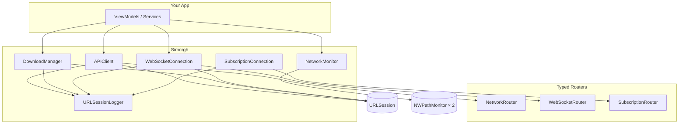

<h1 align="center">Simorgh</h1>

<p align="center">
  <em>The mythical Persian firebird — connecting every realm</em>
</p>

<p align="center">
  <a href="https://swift.org"></a>
  <a href="https://swift.org"></a>
  <a href="https://developer.apple.com/ios/"></a>
  <a href="https://swift.org/package-manager/"></a>
  <a href="LICENSE"></a>
</p>

<p align="center">
A production-grade Swift networking library. One package covers HTTP, WebSocket, subscriptions, downloads, streaming, uploads, and real-time network monitoring — with full Combine + async/await APIs and Swift 6 strict concurrency compliance.
</p>

---

## Table of Contents

<details open>
<summary><strong>📖 Documentation menu</strong></summary>

### Getting started
- [About Simorgh](#about-simorgh)
- [What's inside](#whats-inside)
- [Requirements](#requirements)
- [Installation](#installation)
  - [Swift Package Manager](#swift-package-manager)
  - [Example app](#example-app)
- [Quick Start](#quick-start)

### Core HTTP
- [NetworkRouter](#networkrouter)
  - [GET with query parameters](#get-with-query-parameters)
  - [POST with JSON body](#post-with-json-body)
  - [Form-urlencoded body](#form-urlencoded-body)
  - [API versioning](#api-versioning)
  - [Parameter encoding rules](#parameter-encoding-rules)
- [APIClient](#apiclient)
- [Uploads](#uploads)
  - [Single file](#single-file)
  - [Multipart form data](#multipart-form-data)
- [HTTP Streaming](#http-streaming)

### Downloads
- [Download Manager](#download-manager)
  - [Feature overview](#feature-overview)
  - [Configuration](#configuration)
  - [Enqueue — async/await](#enqueue--asyncawait-ios-15)
  - [Enqueue — Combine](#enqueue--combine)
  - [Observe all tasks](#observe-all-tasks)
  - [Batch enqueue](#batch-enqueue)
  - [Controls](#controls)
  - [Error handling](#error-handling)
  - [Background session wiring](#background-session-wiring)

### Real-time
- [WebSocket](#websocket)
  - [Define endpoint](#define-endpoint)
  - [Connect and receive](#connect-and-receive)
  - [Send messages](#send-messages)
  - [Connection state & reconnect](#connection-state--reconnect)
- [Subscription Protocol](#subscription-protocol-amplify--appsync-style)
  - [Define a subscription](#define-a-subscription)
  - [Async/Await](#asyncawait)
  - [Combine](#combine)
  - [Explicit lifecycle](#explicit-lifecycle)
- [Streaming vs WebSocket vs Subscription](#streaming-vs-websocket-vs-subscription)

### Infrastructure
- [Network Monitoring](#network-monitoring)
  - [VPN live detection](#vpn-live-detection)
  - [One-shot VPN check](#one-shot-vpn-check)
- [Logging](#logging)
  - [Download log events](#download-log-events)
- [Headers and Authentication](#headers-and-authentication)
- [Error Handling](#error-handling)
- [Retry Logic](#retry-logic)
- [Cache Control](#cache-control)
- [Session Management](#session-management)
- [Background Sessions](#background-sessions)

### Reference
- [Thread Safety & Concurrency](#thread-safety--concurrency)
- [Production Configuration](#production-configuration)
- [Architecture](#architecture)
- [API Reference](#api-reference)
- [Contributing](#contributing)
- [License](#license)

</details>

---

## About Simorgh

**Simorgh** (Persian: سیمرغ) is the mythical firebird of Persian literature — a wise creature that connects distant lands. This library carries the same idea: **one Swift package that connects your app to every kind of network transport**.

| | |
|---|---|
| **Problem** | Most Swift networking libraries cover HTTP only. Real apps also need WebSocket feeds, subscription handshakes, background downloads, streaming AI responses, and VPN-aware reachability — often from separate dependencies with inconsistent APIs. |
| **Solution** | Simorgh unifies all of these behind typed router protocols, dual Combine + async/await surfaces, structured logging, and Swift 6 `Sendable` compliance. |
| **Platforms** | iOS 13+ · macOS 13+ · tvOS 13+ · watchOS 7+ |
| **License** | MIT |

> **GitHub About blurb** (for repo settings):  
> *Production-grade Swift networking — HTTP, WebSocket, subscriptions, downloads, streaming, uploads, and live VPN/network monitoring. Combine + async/await. Swift 5 & 6. iOS 13+.*

See also [`.github/ABOUT.md`](.github/ABOUT.md) for suggested repository topics and tags.

---

## What's inside

| Module | Capability |
|---|---|
| `APIClient` | HTTP requests, uploads, multipart, retry, cache, session management |
| `NetworkRouter` | Type-safe endpoint definitions with automatic encoding |
| `DownloadManager` | Priority queue, pause/resume, background sessions, speed/ETA, batch enqueue, HTTP validation |
| `WebSocketConnection` | Full-duplex WebSocket with auto-reconnect and typed messages |
| `SubscriptionRouter` | Amplify/AppSync-style subscribe–unsubscribe handshake over WebSocket |
| `NetworkMonitor` | Real-time WiFi/Cellular/Ethernet/VPN detection via dual `NWPathMonitor` |
| `VPNChecker` | One-shot VPN interface detection (IKEv2, WireGuard, OpenVPN, IPsec) |
| `URLSessionLogger` | 4-level structured logging across all transports |
| `MimeTypeDetector` | Magic-byte MIME detection for uploads and downloads |
| `HeaderHandler` | Fluent builder for auth, content-type, accept, and custom headers |

### Compared to the legacy `main` branch (`SRNetworkManager`)

| Feature | `main` (SRNetworkManager) | `feature/download-manager` (Simorgh) |
|---|---|---|
| HTTP + uploads + cache | ✅ | ✅ |
| Network monitoring | ✅ basic | ✅ dual-monitor VPN detection |
| WebSocket | ❌ | ✅ full-duplex + reconnect |
| Subscription protocol | ❌ | ✅ Amplify/AppSync-style |
| Download manager | ❌ | ✅ pause/resume, batch, background |
| HTTP streaming | ✅ | ✅ + example app tab |
| Structured logging | ✅ HTTP only | ✅ HTTP + WS + downloads + subscriptions |
| Example app | ❌ | ✅ 7-tab demo |
| Swift 6 concurrency | partial | ✅ full `Sendable` support |

---

## Requirements

| | Minimum |
|---|---|
| **Swift** | 5.9+ (Swift 6 supported) |
| **Xcode** | 15+ |
| **iOS** | 13.0+ |
| **macOS** | 13.0+ |
| **tvOS** | 13.0+ |
| **watchOS** | 7.0+ |

---

## Installation

### Swift Package Manager

```swift
// Package.swift
dependencies: [
    .package(url: "https://github.com/siamakrostami/Simorgh.git", from: "1.0.0")
]
```

Or in Xcode: **File → Add Package Dependencies** → paste the URL above.

### Example app

The repo includes `Example/SimorghExampleApp` — a tabbed demo covering every major API:

| Tab | Demonstrates |
|---|---|
| **Posts** | HTTP GET with `APIClient` + `NetworkRouter` |
| **Realtime** | Raw WebSocket connection and typed message stream |
| **Subscription** | Amplify-style subscribe/unsubscribe over WebSocket (Binance trades) |
| **Downloads** | `DownloadManager` — single URL, batch catalog (PDF/MP4/MP3/images/ZIP), pause/resume, priority picker, Quick Look preview |
| **Upload** | Multipart file upload with progress |
| **Stream** | HTTP streaming (`asyncStreamRequest`) with newline-delimited chunks |
| **Network** | Live WiFi/Cellular/VPN status via `NetworkMonitor` |

Open `Example/SimorghExampleApp.xcodeproj` in Xcode and run on a simulator or device.

---

## Quick Start

### Define an endpoint

```swift
import Simorgh

struct GetUsersEndpoint: NetworkRouter {
    var baseURLString: String { "https://api.example.com" }
    var path: String { "/users" }
    var method: RequestMethod? { .get }
}
```

### Fetch — async/await

```swift
let client = APIClient()
let users: [User] = try await client.request(GetUsersEndpoint())
```

### Fetch — Combine

```swift
client.request(GetUsersEndpoint())
    .sink(
        receiveCompletion: { print($0) },
        receiveValue: { (users: [User]) in print(users) }
    )
    .store(in: &cancellables)
```

---

## NetworkRouter

`NetworkRouter` is the core protocol for defining type-safe HTTP endpoints. Associated types `Parameters` and `QueryParameters` (both `Codable`) ensure compile-time safety for request bodies and query strings.

```swift
public protocol NetworkRouter: Sendable {
    associatedtype Parameters: Codable = EmptyParameters
    associatedtype QueryParameters: Codable = EmptyParameters

    var baseURLString: String { get }
    var path: String { get }
    var method: RequestMethod? { get }
    var headers: [String: String]? { get }
    var params: Parameters? { get }
    var queryParams: QueryParameters? { get }
    var version: APIVersion? { get }
    func asURLRequest() throws -> URLRequest
}
```

Supported HTTP methods: `GET` · `POST` · `PUT` · `PATCH` · `DELETE` · `HEAD` · `TRACE`

### GET with query parameters

```swift
struct SearchUsersEndpoint: NetworkRouter {
    struct Query: Codable { let q: String; let limit: Int }

    var baseURLString: String { "https://api.example.com" }
    var path: String { "/users/search" }
    var method: RequestMethod? { .get }
    var queryParams: Query? { Query(q: "alice", limit: 20) }
}
// → GET https://api.example.com/users/search?q=alice&limit=20
```

### POST with JSON body

```swift
struct CreateUserEndpoint: NetworkRouter {
    struct Body: Codable { let name: String; let email: String }

    var baseURLString: String { "https://api.example.com" }
    var path: String { "/users" }
    var method: RequestMethod? { .post }
    var params: Body? { body }

    private let body: Body
    init(name: String, email: String) { body = Body(name: name, email: email) }
}
```

### Form-urlencoded body

Set the content type header to trigger form encoding instead of JSON:

```swift
struct LoginEndpoint: NetworkRouter {
    struct Body: Codable { let username: String; let password: String }

    var baseURLString: String { "https://api.example.com" }
    var path: String { "/login" }
    var method: RequestMethod? { .post }
    var headers: [String: String]? { [ContentTypeHeaders.name: ContentTypeHeaders.formData.value] }
    var params: Body? { credentials }

    private let credentials: Body
    init(username: String, password: String) {
        credentials = Body(username: username, password: password)
    }
}
```

### API versioning

```swift
struct V2UsersEndpoint: NetworkRouter {
    var baseURLString: String { "https://api.example.com" }
    var version: APIVersion? { .v2 }          // inserts "/v2" into the path
    var path: String { "/users" }
    var method: RequestMethod? { .get }
}
// → GET https://api.example.com/v2/users
```

### Parameter encoding rules

| HTTP method | `queryParams` | `params` | Encoding |
|---|---|---|---|
| GET, DELETE, HEAD | ✅ | ❌ | URL query string |
| POST, PUT, PATCH | optional | ✅ | JSON body (default) |
| POST, PUT, PATCH + `formData` header | optional | ✅ | `application/x-www-form-urlencoded` |

Build a request manually when needed:

```swift
let request = try endpoint.asURLRequest()
```

---

## APIClient

```swift
let client = APIClient(
    configuration: .default,              // URLSessionConfiguration
    configurationDelegate: nil,           // optional URLSessionDelegate
    qos: .userInitiated,
    logLevel: .standard,
    defaultCacheStrategy: .useProtocolCachePolicy,
    decoder: JSONDecoder(),
    retryHandler: DefaultRetryHandler(numberOfRetries: 3)
)
```

### Cancel all in-flight requests

```swift
client.cancelAllRequests()
```

---

## Uploads

### Single file

```swift
// Async/Await
let response: UploadResponse = try await client.uploadRequest(
    endpoint, withName: "photo", data: imageData
) { progress in print("\(Int(progress * 100))%") }

// Combine
client.uploadRequest(endpoint, withName: "photo", data: imageData) { print($0) }
    .sink(receiveCompletion: { _ in }, receiveValue: { print($0) })
    .store(in: &cancellables)
```

MIME type is auto-detected from file bytes when not specified.

### Multipart form data

Equivalent to `curl --form`:

```swift
let fields: [MultipartFormField] = [
    .file(name: "file", data: fileData, fileName: "archive.zip", mimeType: "application/zip"),
    .text(name: "checksum", value: "abc123"),
    .text(name: "type", value: "document"),
    .text(name: "date", value: "2025-01-01"),
]

// Async/Await
let response: UploadResponse = try await client.uploadRequest(endpoint, formFields: fields) {
    print("\(Int($0 * 100))%")
}

// Combine
client.uploadRequest(endpoint, formFields: fields) { print($0) }
    .sink(receiveCompletion: { _ in }, receiveValue: { print($0) })
    .store(in: &cancellables)
```

`MultipartFormField` cases:
- `.text(name:value:)` — plain text field
- `.file(name:data:fileName:mimeType:)` — file field; `mimeType` auto-detected when `nil`

---

## Download Manager

Production-quality download engine built on `URLSessionDownloadTask`. Supports true pause/resume, priority queuing, background sessions, disk-space guards, HTTP status validation, and per-task speed/ETA — with both Combine and async/await APIs.

### Feature overview

| Feature | Details |
|---|---|
| Pause / Resume | `cancel(byProducingResumeData:)` — resumes from exact byte offset; resume data persisted to disk |
| Priority queue | `critical > high > normal > low` — higher priority tasks jump the pending queue |
| Concurrency cap | Configurable max (default 3); extras wait in priority order |
| Retry | Exponential backoff on network errors (`timedOut`, `notConnectedToInternet`, etc.) |
| HTTP validation | Non-2xx responses rejected — error bodies are not saved as files |
| Speed | 3-second sliding window; delta computed correctly between callbacks (not per-tick spikes) |
| ETA | Remaining bytes ÷ current speed; `nil` when total size unknown |
| Duplicate guard | Same URL blocked while queued, downloading, or paused |
| Disk space guard | Enqueue throws `DownloadError.insufficientDiskSpace` below `minFreeDiskSpace` |
| Background | Pass `backgroundSessionIdentifier` to survive app suspension |
| MIME detection | Auto-detected from file bytes via `MimeTypeDetector`; extension appended when missing |
| Filenames | Percent-encoded URL path components decoded automatically (e.g. `%20` → space) |
| Storage | Each task gets its own subdirectory under `Documents/Downloads/<taskId>/` |
| Logging | Structured download lifecycle events via `URLSessionLogger` (see [Logging](#logging)) |

### Configuration

```swift
let manager = try DownloadManager(
    config: DownloadManagerConfig(
        maxConcurrentDownloads: 3,           // simultaneous active tasks
        maxQueueSize: 100,                   // pending queue cap
        retryPolicy: DownloadRetryPolicy(
            maximumAttempts: 3,
            initialDelay: 1,
            multiplier: 2,
            maximumDelay: 30
        ),
        allowsCellularAccess: true,
        downloadDirectory: nil,              // defaults to Documents/Downloads
        minFreeDiskSpace: 100 * 1024 * 1024, // 100 MB minimum free space
        timeoutInterval: 60,
        backgroundSessionIdentifier: "com.myapp.downloads"
    ),
    logLevel: .standard
)
```

### Enqueue — async/await (iOS 15+)

```swift
for await progress in try manager.download(url: url, fileName: "video.mp4", priority: .high) {
    if progress.isCompleted {
        print("Saved: \(progress.localURL!)")
        break
    }
    if progress.isIndeterminate {
        print("Downloading… \(formatSpeed(progress.speed))")
    } else {
        print("\(Int(progress.fraction * 100))%  \(formatSpeed(progress.speed))  ETA \(progress.eta.map { "\(Int($0))s" } ?? "?")")
    }
}

func formatSpeed(_ bytesPerSec: Double) -> String {
    switch bytesPerSec {
    case ..<1024:                    return String(format: "%.0f B/s", bytesPerSec)
    case ..<(1024 * 1024):           return String(format: "%.1f KB/s", bytesPerSec / 1024)
    case ..<(1024 * 1024 * 1024):    return String(format: "%.2f MB/s", bytesPerSec / (1024 * 1024))
    default:                         return String(format: "%.2f GB/s", bytesPerSec / (1024 * 1024 * 1024))
    }
}
```

### Enqueue — Combine

```swift
let id = try manager.enqueue(url: url, fileName: "video.mp4", priority: .high)

manager.progressPublisher(for: id)
    .receive(on: DispatchQueue.main)
    .sink { p in print("\(Int(p.fraction * 100))%  \(formatSpeed(p.speed))") }
    .store(in: &cancellables)

manager.statePublisher(for: id)
    .sink { state in print("State: \(state)") }
    .store(in: &cancellables)
```

### Observe all tasks

```swift
// Snapshot
let all: [DownloadTask] = manager.tasks

// Combine — full list on every change
manager.tasksPublisher
    .receive(on: DispatchQueue.main)
    .sink { tasks in updateUI(tasks) }
    .store(in: &cancellables)

// Combine — granular events (progress, state, errors)
manager.eventsPublisher
    .sink { event in
        switch event {
        case .progress(let p):              updateProgress(p)
        case .stateChange(_, let state):    print(state)
        case .error(_, let message):       showError(message)
        case .added(let task):              print("Added \(task.fileName)")
        case .removed:                      break
        }
    }
    .store(in: &cancellables)
```

### Batch enqueue

```swift
// Same priority for all URLs
manager.enqueueBatch(urls, priority: .normal)

// Per-item fileName and priority
manager.enqueueBatch([
    (url: pdfURL,  fileName: "report.pdf", priority: .high),
    (url: mp4URL,  fileName: nil,          priority: .normal),
    (url: zipURL,  fileName: "archive.zip", priority: .low),
])
// Duplicates and disk-space violations are silently skipped; returns IDs of enqueued tasks.
```

### Controls

```swift
manager.pause(id: id)            // saves byte offset + resume data to disk
try manager.resume(id: id)       // restores from resume data (memory or disk)
manager.cancel(id: id)           // removes file + resume data + task entry
manager.removeCompleted()        // clears completed tasks from the list
```

### Error handling

```swift
do {
    let id = try manager.enqueue(url: url)
} catch DownloadError.alreadyQueued(let url) {
    print("Already downloading: \(url)")
} catch DownloadError.insufficientDiskSpace(let required, let available) {
    print("Need \(required) bytes free, only \(available) available")
} catch DownloadError.taskNotFound(let id) {
    print("No task with id \(id)")
}
```

### Background session wiring

```swift
// AppDelegate
func application(_ application: UIApplication,
                 handleEventsForBackgroundURLSession identifier: String,
                 completionHandler: @escaping () -> Void) {
    guard identifier == "com.myapp.downloads" else { return }
    downloadManager.backgroundCompletionHandler = completionHandler
}
```

---

## HTTP Streaming

Long-lived server-push responses (newline-delimited JSON, LLM token streams, Server-Sent Events).

```swift
// Async/Await
for try await chunk: DataChunk in client.asyncStreamRequest(StreamEndpoint()) {
    render(chunk)
}

// Combine
client.streamRequest(StreamEndpoint())
    .sink(receiveCompletion: { _ in }, receiveValue: { (chunk: DataChunk) in render(chunk) })
    .store(in: &cancellables)
```

At `.verbose` log level, each decoded chunk emits a `🌊 STREAM CHUNK` line.

---

## WebSocket

Full-duplex WebSocket with typed messages, ping/pong, and automatic reconnect. Each `WebSocketConnection` owns its own `URLSession` — closing a WebSocket does not affect in-flight HTTP requests.

### Define endpoint

```swift
struct ChatSocket: WebSocketRouter {
    var baseURLString: String { "wss://api.example.com" }
    var path: String { "/chat" }
    var queryParams: [String: String]? { ["room": "general"] }
    var headers: [String: String]? { ["Authorization": "Bearer \(token)"] }
    var protocols: [String] { ["chat.v1"] }
    private let token: String
    init(token: String) { self.token = token }
}
```

### Connect and receive

```swift
let connection = try client.webSocketConnection(
    ChatSocket(token: token),
    options: WebSocketOptions(
        pingInterval: 25,
        reconnectPolicy: WebSocketReconnectPolicy(
            maximumAttempts: 3, initialDelay: 1, multiplier: 2, maximumDelay: 30
        )
    )
)

connection.connect()

Task {
    for try await event in connection.events() {
        switch event {
        case .connected:                            print("Connected")
        case .message(let msg):                     print(try msg.decoded() as ChatMessage)
        case .reconnecting(let attempt, let delay): print("Retry \(attempt) in \(delay)s")
        case .disconnected(let code, _):            print("Closed: \(code)")
        case .pong:                                 break
        }
    }
}
```

> `.connected` fires only after the server confirms the HTTP upgrade handshake — not optimistically on `connect()`.

### Send messages

```swift
try await connection.send(ChatMessage(text: "hello"))   // Encodable → JSON UTF-8 text frame
try await connection.sendText("raw text")
try await connection.sendData(binaryData)
try await connection.ping()
connection.close()
```

### Typed stream

```swift
for try await message in connection.messages(of: ChatMessage.self) {
    print(message)
}
```

### Connection state & reconnect

```swift
// Read current state at any time
let state: WebSocketConnectionState = connection.state
// .idle · .connecting · .connected · .reconnecting(attempt:delay:) · .disconnected

// Reset retry counter and reconnect immediately
connection.reconnect()
```

`close()` is safe during a reconnect delay — the `manuallyClosed` flag prevents the reconnect timer from overriding an explicit close.

---

## Subscription Protocol (Amplify / AppSync style)

For APIs requiring a JSON subscribe/unsubscribe handshake over WebSocket (Binance, Hasura, AppSync, custom backends). No GraphQL required.

### Define a subscription

```swift
struct TradeSubscription: SubscriptionRouter {
    typealias Event = TradeEvent
    var baseURLString: String { "wss://stream.example.com" }
    var path: String { "/ws" }
    let symbol: String

    var subscribeMessage: some Encodable {
        ["method": "SUBSCRIBE", "params": ["\(symbol)@trade"], "id": 1]
    }
    var unsubscribeMessage: (some Encodable)? {
        ["method": "UNSUBSCRIBE", "params": ["\(symbol)@trade"], "id": 1]
    }

    func decodeEvent(from message: WebSocketMessage, using decoder: JSONDecoder) throws -> TradeEvent? {
        try? message.decoded(as: TradeEvent.self, decoder: decoder)
    }
}
```

The library handles the full lifecycle automatically:

1. Connects the WebSocket
2. Sends `subscribeMessage` on every (re)connect
3. Decodes frames via `decodeEvent` — `nil` return silently drops the frame (useful for acks)
4. Sends `unsubscribeMessage` when stopped
5. Auto-reconnects and re-subscribes on disconnect

### Async/Await

```swift
for try await trade in apiClient.subscribe(TradeSubscription(symbol: "btcusdt")) {
    print(trade)
}
// Cancelling the Task sends unsubscribeMessage and closes cleanly.
```

### Combine

```swift
apiClient.subscribe(TradeSubscription(symbol: "btcusdt"))
    .receive(on: DispatchQueue.main)
    .sink(receiveCompletion: { _ in }, receiveValue: { print($0) })
    .store(in: &cancellables)
```

### Explicit lifecycle

```swift
let sub = try apiClient.subscription(TradeSubscription(symbol: "btcusdt"))
sub.connect()
for try await trade in sub.events() { print(trade) }
await sub.disconnect()
```

---

## Streaming vs WebSocket vs Subscription

| | HTTP Streaming | WebSocket | Subscription |
|---|---|---|---|
| Protocol | HTTP keep-alive | `ws://` / `wss://` | `wss://` + JSON handshake |
| Direction | Server → client | Full-duplex | Full-duplex + channel lifecycle |
| Reconnect | New HTTP request | Auto (configurable) | Auto + re-sends subscribe |
| Use case | NDJSON, LLM tokens, SSE | Chat, multiplayer, data feeds | Binance, AppSync, Hasura, Amplify |
| API | `streamRequest` / `asyncStreamRequest` | `webSocketConnection` | `subscription` / `subscribe` |

---

## Network Monitoring

Real-time detection of WiFi, Cellular, Ethernet, and VPN state changes.

```swift
let monitor = NetworkMonitor(shouldDetectVpnAutomatically: true)
monitor.startMonitoring()

// Combine
monitor.status
    .receive(on: DispatchQueue.main)
    .sink { connectivity in
        switch connectivity {
        case .disconnected:          showOfflineBanner()
        case .connected(.wifi):       print("WiFi")
        case .connected(.cellular):   print("Cellular")
        case .connected(.vpn):        print("VPN active")
        case .connected(.ethernet):   print("Ethernet")
        case .connected(.other):      print("Other")
        }
    }
    .store(in: &cancellables)

// Async/Await
Task {
    for await connectivity in monitor.statusStream() {
        await handleChange(connectivity)
    }
}
```

### VPN live detection

VPN state is detected immediately when VPN connects or disconnects — even when the underlying WiFi path stays active. Two `NWPathMonitor` instances run in parallel:

1. **General monitor** — fires on WiFi ↔ Cellular, connected ↔ disconnected
2. **Tunnel monitor** (`requiredInterfaceType: .other`) — fires when tunnel interfaces (`utun`, `tun`, `ppp`, `ipsec`) appear or disappear

Both feed a single `evaluate()` function that reads `path.availableInterfaces` directly, eliminating the `getifaddrs()` race window.

### One-shot VPN check

```swift
let checker = VPNChecker()
if checker.isVPNActive() {
    // IKEv2, WireGuard, OpenVPN, IPsec — all detected
}
```

---

## Logging

Pass `logLevel` to `APIClient` and `DownloadManager`:

```swift
let client = APIClient(logLevel: .verbose)
// .none | .minimal | .standard | .verbose
```

| Level | Output |
|---|---|
| `.none` | Silent (production default) |
| `.minimal` | URL + method |
| `.standard` | + headers, status codes, WS connect/disconnect/reconnect, download lifecycle events |
| `.verbose` | + request/response bodies, WS frames, stream chunks, subscription events, download progress ticks |

### Download log events

When `DownloadManager` is created with `logLevel: .standard` or higher:

| Event | When |
|---|---|
| `ENQUEUED` | Task added to queue |
| `STARTED` | `URLSessionDownloadTask` begins |
| `PAUSED` | Pause requested; resume data saved |
| `RESUMED` | Resumed from resume data |
| `RESPONSE` | HTTP status, content-type, content-length |
| `MIME` | Detected MIME type from file bytes |
| `COMPLETED` | File saved to disk |
| `RETRY` | Network error — exponential backoff scheduled |
| `FAILED` | Retries exhausted or unrecoverable error |
| `CANCELLED` | Task cancelled and cleaned up |

```
⬇️⬇️⬇️ DOWNLOAD STARTED ⬇️⬇️⬇️
🔈 https://example.com/video.mp4
🔼🔼🔼 END 🔼🔼🔼
```

---

## Headers and Authentication

`HeaderHandler` uses a fluent builder. Each call to `build()` returns the accumulated headers and **resets** the builder.

```swift
let headers = HeaderHandler.shared
    .addAuthorizationHeader(type: .bearer(token: "your-token"))
    .addContentTypeHeader(type: .applicationJson)
    .addAcceptHeaders(type: .applicationJson)
    .addAcceptLanguageHeaders(type: .en)
    .addAcceptEncodingHeaders(type: .gzip)
    .addCustomHeader(name: "X-API-Key", value: "your-api-key")
    .build()

struct AuthenticatedEndpoint: NetworkRouter {
    var baseURLString: String { "https://api.example.com" }
    var path: String { "/protected" }
    var method: RequestMethod? { .get }
    var headers: [String: String]? { headers }
}
```

Supported content types: `applicationJson` · `urlEncoded` · `formData`

---

## Error Handling

`NetworkError` conforms to `LocalizedError`. Convenience properties:

```swift
error.localizedDescription   // human-readable message
error.statusCode             // Int? — HTTP status for .customError
error.responseData           // Data? — response body for .customError
```

```swift
do {
    let data: MyModel = try await client.request(endpoint)
} catch let error as NetworkError {
    switch error {
    case .urlError(let e) where e.code == .notConnectedToInternet:
        showOfflineMessage()
    case .customError(let statusCode, _) where statusCode == 401:
        handleUnauthorized()
    case .decodingError(let e):
        print("Decoding failed: \(e)")
    case .responseError(let e):
        print("Response error: \(e)")
    case .unknown:
        print("Unknown error")
    }
}
```

---

## Retry Logic

### Built-in

```swift
APIClient(retryHandler: DefaultRetryHandler(numberOfRetries: 3))
```

### Custom

```swift
struct CustomRetryHandler: RetryHandler {
    func shouldRetry(request: URLRequest, error: NetworkError) -> Bool {
        switch error {
        case .urlError(let e):
            return e.code == .notConnectedToInternet || e.code == .timedOut
        case .customError(let code, _):
            return code >= 500
        default:
            return false
        }
    }
    func modifyRequestForRetry(client: APIClient, request: URLRequest, error: NetworkError) -> (URLRequest, NetworkError?) {
        var req = request
        req.setValue("retry", forHTTPHeaderField: "X-Retry-Attempt")
        return (req, nil)
    }
}
```

---

## Cache Control

```swift
let client = APIClient(defaultCacheStrategy: .returnCacheDataElseLoad)
```

| Strategy | Behavior |
|---|---|
| `.useProtocolCachePolicy` | System default (default) |
| `.reloadIgnoringLocalCacheData` | Always fetch from network |
| `.returnCacheDataElseLoad` | Cache first, network fallback |
| `.returnCacheDataDontLoad` | Cache only — no network if missing |
| `.reloadRevalidatingCacheData` | Revalidate with server before using cache |

```swift
// Runtime update
client.updateDefaultCacheStrategy(.reloadIgnoringLocalCacheData)

// Custom URLCache
client.updateCacheConfiguration(CacheConfiguration(
    memoryCapacity: 20 * 1024 * 1024,   // 20 MB
    diskCapacity: 100 * 1024 * 1024,    // 100 MB
    diskPath: nil
))
```

---

## Session Management

```swift
// Cancel all active requests and clear the retry queue
client.cancelAllRequests()

// Update session configuration at runtime (invalidates existing sessions by default)
let newConfig = URLSessionConfiguration.default
newConfig.timeoutIntervalForRequest = 30
client.updateConfiguration(newConfig)
```

---

## Background Sessions

### Downloads

See [Background session wiring](#background-session-wiring) for the full setup.

```swift
let manager = try DownloadManager(config: DownloadManagerConfig(
    backgroundSessionIdentifier: "com.myapp.downloads"
))
```

### Uploads (large files)

Background URL sessions require file-based upload tasks. Write the body to disk first:

```swift
let tempURL = FileManager.default.temporaryDirectory.appendingPathComponent(UUID().uuidString)
try data.write(to: tempURL)

let bgConfig = URLSessionConfiguration.background(withIdentifier: "com.myapp.uploads")
bgConfig.isDiscretionary = false
bgConfig.sessionSendsLaunchEvents = true

let uploadClient = APIClient(configuration: bgConfig)
```

> `APIClient.uploadRequest` uses data-based tasks (works while app is active/backgrounded). For uploads that must survive app termination, use `URLSession.uploadTask(with:fromFile:)` directly with the config above.

---

## Thread Safety & Concurrency

| Component | Mechanism |
|---|---|
| `APIClient` | `DispatchQueue` with `.barrier` writes, `@unchecked Sendable` |
| `DownloadManager` | `NSLock` protecting all mutable state |
| `NetworkMonitor` | `NSLock` + dedicated monitor queue |
| `HeaderHandler` | Synchronized builder, resets on `build()` |
| `UploadProgressDelegate` | Thread-safe progress reporting |

Swift 6 strict concurrency is fully supported (`SPM_SWIFT_6` define active). All public API is `Sendable`-safe.

---

## Production Configuration

```swift
#if DEBUG
let logLevel: LogLevel = .verbose
let retryHandler = DefaultRetryHandler(numberOfRetries: 3)
#else
let logLevel: LogLevel = .none
let retryHandler = DefaultRetryHandler(numberOfRetries: 1)
#endif

let client = APIClient(logLevel: logLevel, retryHandler: retryHandler)
```

---

## Architecture



**Layer responsibilities:**

| Layer | Role |
|---|---|
| **Routers** | Describe *what* to connect to — URL, method, headers, body |
| **APIClient / DownloadManager / WebSocketConnection** | Handle *how* — sessions, retries, encoding, lifecycle |
| **URLSessionLogger** | Cross-cutting observability at 4 log levels |
| **NetworkMonitor** | Independent reachability + VPN observer |

---

## API Reference

| Type | Role |
|---|---|
| `APIClient` | HTTP requests, uploads, streaming, WebSocket factory |
| `NetworkRouter` | HTTP endpoint definition protocol |
| `WebSocketRouter` | WebSocket endpoint protocol |
| `SubscriptionRouter` | Subscribe/unsubscribe lifecycle protocol |
| `WebSocketConnection` | Live duplex connection handle |
| `WebSocketConnectionState` | `.idle` · `.connecting` · `.connected` · `.reconnecting` · `.disconnected` |
| `WebSocketOptions` | Ping interval, reconnect policy |
| `DownloadManager` | Multi-task download engine |
| `DownloadManagerConfig` | Concurrency, retry, disk, background session settings |
| `DownloadRetryPolicy` | Exponential backoff for network errors |
| `DownloadTask` | Task metadata — URL, fileName, state, bytes, localURL |
| `DownloadProgress` | Live snapshot — fraction, speed (B/s), ETA, completion |
| `DownloadPriority` | `.low` · `.normal` · `.high` · `.critical` |
| `DownloadState` | `.queued` · `.downloading` · `.paused` · `.completed` · `.failed` · `.cancelled` |
| `DownloadEvent` | Combine event — progress, stateChange, error, added, removed |
| `DownloadError` | Typed errors — duplicate URL, disk space, task not found |
| `NetworkMonitor` | Connectivity + VPN observer |
| `VPNChecker` | One-shot VPN detection |
| `NetworkError` | Typed error enum with `LocalizedError` |
| `RetryHandler` | Protocol for custom retry logic |
| `MultipartFormField` | `.file` / `.text` multipart fields |
| `HeaderHandler` | Builder for HTTP request headers |
| `CacheStrategy` | Maps to `URLRequest.CachePolicy` |
| `CacheConfiguration` | `URLCache` memory/disk capacities |
| `URLSessionLogger` | Structured request/response/download logging |
| `MimeTypeDetector` | Magic-byte MIME detection for downloads and uploads |
| `APIVersion` | API path versioning (`.v1`, `.v2`, custom) |

---

## Contributing

1. Fork the repository
2. Create a feature branch (`git checkout -b feat/my-feature`)
3. Make your changes with tests where applicable
4. Run the test suite: `swift test`
5. Ensure the example app builds in Xcode
6. Submit a pull request

---

## License

MIT — see [LICENSE](LICENSE).
